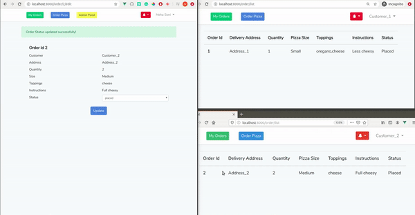

# Laravel Live Notifications

## Demo

## How to setup project
To setup this project with your credentials, follow these steps-
  - Clone or download the project.
  - create .env file by copying .env.example and replace its credentials with yours.
    (Important - Place  Pusher's credentials carefully, what you need to do is-)
    - Go to https://pusher.com/ and create your account.
    - Create a channel or app of named "pizza-tracker"
    - Inside pizza-tracker/debug-console you can see response of events.
 - Now run these commands inside your project directory
    ```sh
        $ composer install
        $ npm install
        $ php artisan migrate
        $ php artisan serve
        $ npm run dev
    ```
  - Register your account and change your role to admin from DB.
  - Register one more account as a customer.
  ### Method-1 ( Via admin panel )
  - Open your account in one window and open customer account in incognito window.
  - Create order as a customer (From incognito).
  - Change the status of created order from admin panel.
  - See live notifications at customer panel.
  ### Method-2 ( Via Cron jobs )
  - cd path_to_your_project
  - Open crontab file using below command
    ```sh
        $ crontab -e
    ```
  - Place the below code inside file
      ```sh
      * * * * * cd /path-to-your-project && php artisan schedule:run >> /dev/null 2>&1
      ```
      ```
  - Now open the customer window and you will get the notifications of order status in every minute without update status from admin panel. ( Only if order is of "current date" and not of "handed status" )
  - You can change the notification receiving time from "Commands/SendOrderStatusUpdateNotification.php".

